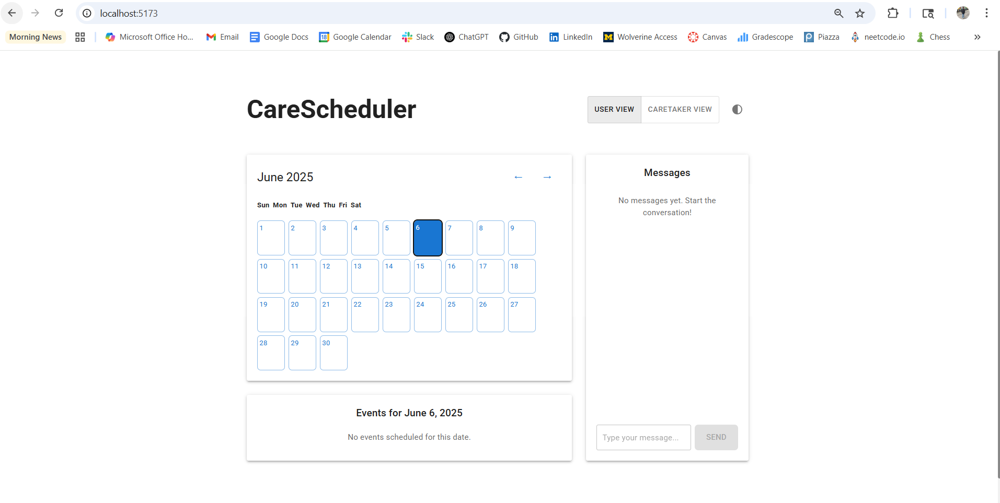

# CareScheduler

A simple scheduling and reminder tool designed for children and elderly users. This frontend-only React application focuses on accessibility, ease of use, and a clean interface.



## Features

- **User Types**: Toggle between "User" and "Caretaker" views
- **Calendar View**: Interactive calendar with event display
- **Event Management**: Add one-time events and recurring reminders
- **Messaging System**: Simple chat interface for communication
- **Accessibility Features**:
  - High contrast mode
  - Large text and buttons
  - Responsive design
  - Screen reader support

## Getting Started

### Prerequisites

- Node.js (v14 or higher)
- npm (v6 or higher)

### Installation

1. Clone the repository:
   ```bash
   git clone <repository-url>
   cd carescheduler
   ```

2. Install dependencies:
   ```bash
   npm install
   ```

3. Start the development server:
   ```bash
   npm run dev
   ```

4. Open [http://localhost:5173](http://localhost:5173) in your browser.

## Usage

### User View
- View scheduled events and reminders
- Send messages to caretakers
- Navigate the calendar

### Caretaker View
- Add new events and reminders
- Set up recurring events
- View and respond to messages
- Manage the schedule

### Accessibility Features
- Toggle high contrast mode using the contrast icon
- Use keyboard navigation (Tab, Enter, Space)
- Screen reader compatible
- Responsive design for all devices

## Development

### Project Structure
```
src/
  ├── components/     # React components
  ├── types/         # TypeScript type definitions
  ├── styles/        # Global styles
  ├── utils/         # Utility functions
  ├── App.tsx        # Main application component
  └── main.tsx       # Application entry point
```

### Available Scripts

- `npm run dev` - Start development server
- `npm run build` - Build for production
- `npm run preview` - Preview production build
- `npm run lint` - Run ESLint
- `npm run type-check` - Run TypeScript type checking
